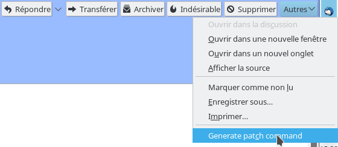

# Patch command

## A Thunderbird add-on to generate command lines to send patches

You have to send a lot of patches to mailing list with the `git send-email`
command line utility, but are tired of manually picking email addresses and
email IDs to paste them in your command line? This Thuderbird add-on has been
made just to address your needs. From a given email in Thuderbird, it generates
the whole command line to answer to this email and selects it; all you need to
do is to copy/paste this single line into your terminal to send your patch.

Oh, well, technically you still have to add the name of the patch you want to
send… but the `--to=` and `--cc=` and `--in-reply-to=` should all be handled
for you.

## Installation

Please see Mozilla's instructions to
[install the add-on locally](https://developer.mozilla.org/en-US/Add-ons/Thunderbird/Building_a_Thunderbird_extension_7:_Installation)
or to
[package it into a .xpi file](https://developer.mozilla.org/en-US/Add-ons/Thunderbird/Building_a_Thunderbird_extension_8:_packaging).

Under UNIX-like systems you can create the .xpi file by simply running:

    cd /path/to/PatchCmd/
    make

## Usage

Once installed, go to Thunderbird and select an email, and go to the email pane
(the one in which the body of the email is displayed). You have `Reply` and
`Reply All`/`Reply to list` and `Forward` and `Archive`, `Junk` buttons and so
on at the top of the pane, on the header box. The last of those buttons labeled
`Other`. It opens a drop-down menu if you click on it. Do so: there is now a
new item entitled `Generate patch command`. This is it! Click on it, and a
pop-up window will show you the generated command line, already selected for
you to copy.

Note that the text box is editable, so that you can edit the command before you
copy it.

## Screenshots

The new command (sorry guys, my interface is not in English):

.

The pop-up:

.

## Disclaimers

### Regarding security

Always be **extremely careful** with what you copy and paste into your
terminal. People have shown [many
times](https://thejh.net/misc/website-terminal-copy-paste) that it is possible
to hide rogue code. You have no reason to believe me, after all.

Also, it could be that some input coming from the headers will break the
commands. The add-on encloses it with single quotes, and tries to escape single
quotes coming from the input, but there might be some subtleties I forgot to
deal with. Just be cautious, and check for correctness of the command.

### Regarding responsibility

Be cautious before you validate your command line: read and proofread whatever
command you enter. The add-on provide the commands as a best effort, but is not
error prone. I will not be responsible if you send trash to a public mailing
list, or if you send emails to the wrong people. So again: verify that
everything looks fine before sending the email.

Also see the License section below.

## License

Public domain. No warranty of any kind. See
[LICENSE](https://github.com/Qeole/PatchCmd/blob/master/LICENSE).
Because do whatever you want with this code.
